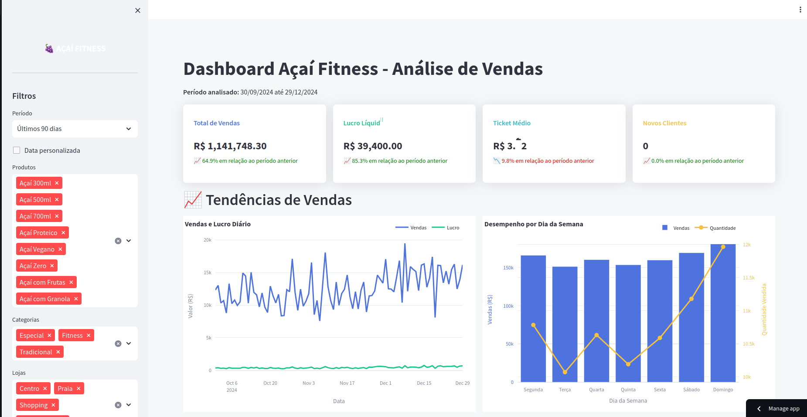

# Dashboard de Análise de Vendas - Açaí Fitness


Um dashboard moderno e interativo para análise de vendas da rede Açaí Fitness, desenvolvido com Streamlit e Plotly.

## 📊 Funcionalidades

- **Visualização de métricas em tempo real**
  - Vendas totais, lucro líquido, ticket médio e novos clientes
  - Comparação com períodos anteriores
  
- **Análise de tendências**
  - Visualização de vendas diárias
  - Desempenho por dia da semana
  - Análise de sazonalidade mensal
  
- **Performance de produtos e canais**
  - Top produtos mais vendidos
  - Análise de margem de lucro por produto
  - Distribuição de vendas por canal
  - Ticket médio por canal
  
- **Insights automáticos**
  - Análise de eficiência operacional
  - Impacto de promoções nos resultados
  - Comparação de performance entre lojas
  - Recomendações baseadas em dados

- **Padrões temporais**
  - Mapas de calor de vendas por período
  - Distribuição mensal e semanal

## 🛠️ Instalação

1. Clone este repositório:
```bash
git clone https://github.com/seunome/acai-fitness-dashboard.git
cd acai-fitness-dashboard
```

2. Crie e ative um ambiente virtual:
```bash
python -m venv venv
source venv/bin/activate  # No Windows: venv\Scripts\activate
```

3. Instale as dependências:
```bash
pip install -r requirements.txt
```

4. Execute o dashboard:
```bash
streamlit run dash_st.py
```

## 📋 Requisitos

- Python 3.10+
- Pandas
- Streamlit
- Plotly
- Matplotlib
- Seaborn
- NumPy

## 📁 Estrutura do Projeto

```
acai-fitness-dashboard/
├── dash_st.py           # Arquivo principal do dashboard
├── requirements.txt     # Dependências do projeto
├── README.md            # Este arquivo
└── vendas_acai_5_anos_completo.csv  # Dados de vendas (não incluído no repositório)
```

## 📊 Capturas de Tela



## 🚀 Como Usar

1. Prepare seu arquivo CSV com o formato correto (veja [Formato dos Dados](#-formato-dos-dados))
2. Execute o dashboard com `streamlit run dash_st.py`
3. Use os filtros no sidebar para personalizar sua análise
4. Navegue pelas diferentes seções para obter insights sobre as vendas

## 📈 Formato dos Dados

O dashboard espera um arquivo CSV com as seguintes colunas:

- `Data`: Data da venda (formato: DD/MM/AAAA)
- `Produto`: Nome do produto
- `Categoria`: Categoria do produto
- `Localizacao`: Nome da loja
- `Canal`: Canal de venda (ex: Loja Física, Delivery, etc.)
- `Qtd_Vendida`: Quantidade vendida
- `Preco_Unitario`: Preço unitário do produto
- `Valor_Total`: Valor total da venda
- `Custo_Materiais`: Custo dos materiais
- `Custo_Entrega`: Custo de entrega
- `Receita_Liquida`: Receita líquida
- `Receita_Loja`: Receita da loja
- `Desconto_Cliente`: Desconto aplicado ao cliente
- `Taxa_Plataforma`: Taxa da plataforma
- `Lucro_Liquido`: Lucro líquido
- `Funcionarios`: Número de funcionários
- `Comissao_Func`: Comissão dos funcionários
- `Tempo_Preparo`: Tempo de preparação (minutos)
- `Distancia_Entrega`: Distância de entrega
- `Clientes_Unicos`: Número de clientes únicos
- `Pessoas_Atendidas`: Número de pessoas atendidas
- `Tempo_Entrega`: Tempo de entrega
- `Cliente_Novo`: Se o cliente é novo (True/False)
- `Capacidade_Max`: Capacidade máxima
- `Promocao`: Se há promoção (True/False)
- `Desconto_Promocao`: Valor do desconto da promoção
- `Qtde_Desconto`: Quantidade de descontos aplicados

## 🤝 Contribuindo

Contribuições são bem-vindas! Sinta-se à vontade para abrir issues e pull requests para melhorar este dashboard.

1. Faça um fork do projeto
2. Crie sua branch de recurso (`git checkout -b feature/novoRecurso`)
3. Faça commit das suas alterações (`git commit -m 'Adicionando novo recurso'`)
4. Faça push para a branch (`git push origin feature/novoRecurso`)
5. Abra um Pull Request

## 📄 Licença

Este projeto está licenciado sob a licença MIT - veja o arquivo LICENSE para detalhes.

## 👨‍💻 Autor

Desenvolvido por [Ernesto Juscamayta](https://www.linkedin.com/in/v-ernesto-a-juscamayta-440298b0) para Açaí Fitness.

---

⭐️ Se este projeto foi útil para você, deixe uma estrela!
